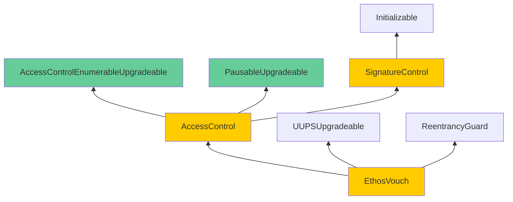

Acidic Lemonade Vulture

Medium

# Corruptible Upgradability Pattern

### Summary

The storage layouts of `EthosVouch.sol` and `ReputationMarket.sol` may become corrupted during upgrades due to inconsistent upgradability patterns.

### Root Cause

The project leverages OpenZeppelin version 5, which adopts a structured storage schema. This schema ensures that each base contract manages its own storage slot, organizing all variables required for its functionality within a dedicated structure. While this approach is robust, the project deviates from it by introducing custom base contracts that do not adhere to the structured storage pattern. Instead, these contracts define independent storage variables at the contract level.

The issue is further compounded by the use of complex inheritance hierarchies that rely heavily on multiple inheritance. This design choice, coupled with the project's reliance on proxy contracts, makes updates to base contracts inherently risky and difficult to execute. Additionally, the use of a mix of non-upgradable and upgradable contracts exacerbates the problem, as inconsistencies in storage allocation can lead to data corruption.

### Internal Pre-Conditions

_No response_

### External Pre-Conditions

_No response_

### Attack Path

_No response_

### Impact

The fragmented upgradeability model increases the risk of storage collisions and data inconsistencies during contract updates. These issues may result in partial or complete corruption of critical data stored in the proxy contracts’ storage.

### PoC

The following inheritance diagram illustrates the structure for `EthosVouch`. The issues in `ReputationMarket` follow a similar pattern.

[EthosVouch.sol](https://github.com/sherlock-audit/2024-11-ethos-network-ii/blob/57c02df7c56f0b18c681a89ebccc28c86c72d8d8/ethos/packages/contracts/contracts/EthosVouch.sol#L67-L67)

### Mitigation

To address these risks and ensure a stable upgradeability framework:
- Transition all custom base contracts to use the structured storage pattern, aligning with OpenZeppelin's practices.
- Replace any remaining non-upgradable OpenZeppelin contracts with their upgradable counterparts to maintain consistency.