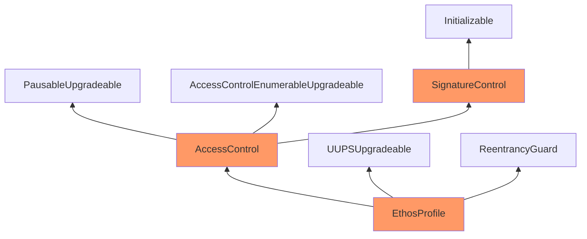

Kind Eggplant Condor

Medium

# Corruptible Upgradibility Pattern in EthosVouch and ReputationMarket

### Summary

The usage of non-upgradeable `ReentrancyGuard` may introduce storage collissions if either the `EthosVouch` or `ReputationMarket` contract gets upgraded.


https://github.com/sherlock-audit/2024-11-ethos-network-ii/blob/main/ethos/packages/contracts/contracts/EthosVouch.sol#L11

### Root Cause

Currently, OpenZeppelin has 2 reentrancy guard contracts:
- https://github.com/OpenZeppelin/openzeppelin-contracts-upgradeable/blob/master/contracts/utils/ReentrancyGuardUpgradeable.sol
- https://github.com/OpenZeppelin/openzeppelin-contracts/blob/master/contracts/utils/ReentrancyGuard.sol
As of now, the latter one (non-upgradeable) is used in the `EthosVouch` and `ReputationMarket` contracts.

### Internal pre-conditions

Either of the aforementioned contracts gets upgraded.

### External pre-conditions

_No response_

### Attack Path

_No response_

### Impact

The project’s inheritance hierarchy is complex and extensively leverages multiple inheritance rather than a simple linear structure. This, combined with a reliance on proxy contracts for deployment, means that updating base contracts will be challenging, if not impossible. Further complicating this is the mixture of non-upgradable and upgradable base contracts from OpenZeppelin; some are from the standard OpenZeppelin library and define their own contract-level variables without supporting upgradability.

These factors create a fragmented upgradeability model, which may lead to significant issues when performing contract upgrades. Updating underlying contracts may lead to inconsistencies in the data stored in the proxy contract storage.

### PoC

This is the inheritance UML diagram of the `ReputationMarket` contract. The inheritance layout of the `EthosVouch` contract is corruptible, likewise.



### Mitigation

Use `ReentrancyGuardUpgradeable` instead, as it has proper storage gaps reserved.

Because it inherits from `Initializable`, whereas the simple (plain) `ReentrancyGuard` doesn't:
```solidity
// SPDX-License-Identifier: MIT
// OpenZeppelin Contracts (last updated v5.1.0) (utils/ReentrancyGuard.sol)

pragma solidity ^0.8.20;

/**
 * @dev Contract module that helps prevent reentrant calls to a function.
 *
 * Inheriting from `ReentrancyGuard` will make the {nonReentrant} modifier
 * available, which can be applied to functions to make sure there are no nested
 * (reentrant) calls to them.
 *
 * Note that because there is a single `nonReentrant` guard, functions marked as
 * `nonReentrant` may not call one another. This can be worked around by making
 * those functions `private`, and then adding `external` `nonReentrant` entry
 * points to them.
 *
 * TIP: If EIP-1153 (transient storage) is available on the chain you're deploying at,
 * consider using {ReentrancyGuardTransient} instead.
 *
 * TIP: If you would like to learn more about reentrancy and alternative ways
 * to protect against it, check out our blog post
 * https://blog.openzeppelin.com/reentrancy-after-istanbul/[Reentrancy After Istanbul].
 */
abstract contract ReentrancyGuard {
    // Booleans are more expensive than uint256 or any type that takes up a full
    // word because each write operation emits an extra SLOAD to first read the
    // slot's contents, replace the bits taken up by the boolean, and then write
    // back. This is the compiler's defense against contract upgrades and
    // pointer aliasing, and it cannot be disabled.

    // The values being non-zero value makes deployment a bit more expensive,
    // but in exchange the refund on every call to nonReentrant will be lower in
    // amount. Since refunds are capped to a percentage of the total
    // transaction's gas, it is best to keep them low in cases like this one, to
    // increase the likelihood of the full refund coming into effect.
    uint256 private constant NOT_ENTERED = 1;
    uint256 private constant ENTERED = 2;

    uint256 private _status;
```

vs.

```solidity
pragma solidity ^0.8.20;
import {Initializable} from "../proxy/utils/Initializable.sol";

/**
 * @dev Contract module that helps prevent reentrant calls to a function.
 *
 * Inheriting from `ReentrancyGuard` will make the {nonReentrant} modifier
 * available, which can be applied to functions to make sure there are no nested
 * (reentrant) calls to them.
 *
 * Note that because there is a single `nonReentrant` guard, functions marked as
 * `nonReentrant` may not call one another. This can be worked around by making
 * those functions `private`, and then adding `external` `nonReentrant` entry
 * points to them.
 *
 * TIP: If EIP-1153 (transient storage) is available on the chain you're deploying at,
 * consider using {ReentrancyGuardTransient} instead.
 *
 * TIP: If you would like to learn more about reentrancy and alternative ways
 * to protect against it, check out our blog post
 * https://blog.openzeppelin.com/reentrancy-after-istanbul/[Reentrancy After Istanbul].
 */
abstract contract ReentrancyGuardUpgradeable is Initializable {
    // Booleans are more expensive than uint256 or any type that takes up a full
    // word because each write operation emits an extra SLOAD to first read the
    // slot's contents, replace the bits taken up by the boolean, and then write
    // back. This is the compiler's defense against contract upgrades and
    // pointer aliasing, and it cannot be disabled.

    // The values being non-zero value makes deployment a bit more expensive,
    // but in exchange the refund on every call to nonReentrant will be lower in
    // amount. Since refunds are capped to a percentage of the total
    // transaction's gas, it is best to keep them low in cases like this one, to
    // increase the likelihood of the full refund coming into effect.
    uint256 private constant NOT_ENTERED = 1;
    uint256 private constant ENTERED = 2;

    /// @custom:storage-location erc7201:openzeppelin.storage.ReentrancyGuard
    struct ReentrancyGuardStorage {
        uint256 _status;
    }

    // keccak256(abi.encode(uint256(keccak256("openzeppelin.storage.ReentrancyGuard")) - 1)) & ~bytes32(uint256(0xff))
    bytes32 private constant ReentrancyGuardStorageLocation = 0x9b779b17422d0df92223018b32b4d1fa46e071723d6817e2486d003becc55f00;

    function _getReentrancyGuardStorage() private pure returns (ReentrancyGuardStorage storage $) {
        assembly {
            $.slot := ReentrancyGuardStorageLocation
        }
    }

    /**
     * @dev Unauthorized reentrant call.
     */
    error ReentrancyGuardReentrantCall();

    function __ReentrancyGuard_init() internal onlyInitializing {
        __ReentrancyGuard_init_unchained();
    }

    function __ReentrancyGuard_init_unchained() internal onlyInitializing {
        ReentrancyGuardStorage storage $ = _getReentrancyGuardStorage();
        $._status = NOT_ENTERED;
    }

```