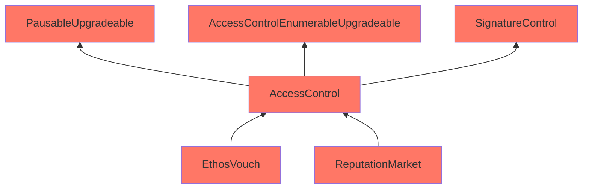

Immense Aegean Orca

Medium

# Corruptible Upgradability Pattern

### Summary

The EthosContracts (EthosVouch, ReputationMarket) are UUPSUpgradeable. However, the current implementation has multiple issues regarding upgradability.

### Root Cause

Following is the inheritance chain of the EthosContracts.

The Ethos contracts are meant to be upgradeable. However, it inherits contracts that are not upgrade-safe.

The `AccessControl` and `SignatureControl` , `EthosVouch` , `ReputatoinMarket` are contracts written by Ethos team, and contain storage slots but there are no gaps implemented.

### Internal pre-conditions

If admin performs an upgrade and wants to add another storage slot in AccessControl or SignatureControl, EthosVouch, ReputatoinMarket contracts, the storage slot would mess up.

### External pre-conditions

N/A

### Attack Path

N/A

### Impact

Storage of vault contracts might be corrupted during upgrading.

### PoC

N/A

### Mitigation

1. Add gaps in AccessControl, SignatureControl, EthosVouch, ReputationMarket
