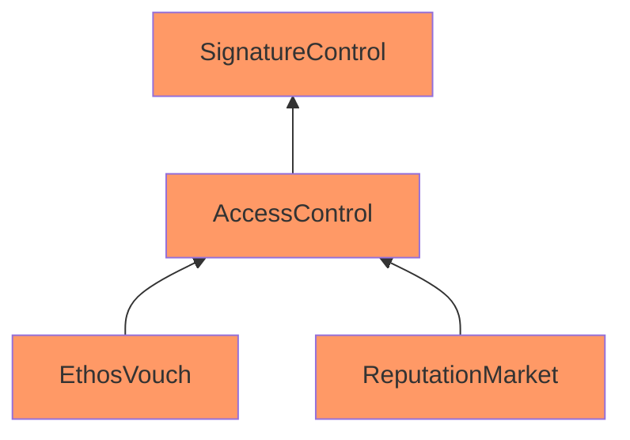

Long Gunmetal Salmon

Medium

# Corruptible Contract's Upgradeability

### Summary

Storage of (EthosVouch, ReputationMarket) might be corrupted during an upgrade.

### Root Cause

The project uses OpenZeppelin version 5, which employs a structured storage schema. However:

1. Custom base contracts deviate from this pattern, defining variables at the contract level.
2. The inheritance hierarchy is overly complex, relying on multiple inheritance.
3. It mixes upgradable and non-upgradable OpenZeppelin components, causing storage inconsistencies.
4. Proxy contract reliance makes updating base contracts risky due to potential storage misalignment.

These issues undermine the project's upgradability.

### Internal Pre-Conditions

If an administrator initiates an upgrade and attempts to add a new storage slot to any of these contracts (e.g., AccessControl, SignatureControl, EthosVouch, or ReputationMarket), it could lead to misalignment of storage and potential corruption.

### External Pre-Conditions

No external conditions are applicable.

### Attack Path

Not applicable in this context.

### Impact

These factors create a fragmented upgradeability model, which may lead to significant issues when performing contract upgrades. Updating underlying contracts may lead to inconsistencies in the data stored in the proxy contract storage.
### Proof of Concept (PoC)

Below is the inheritance diagram for `EthosVouch`, `ReputationMarket`

### Mitigation

To resolve the issue
- Ensure structured storage usage across all base contracts.