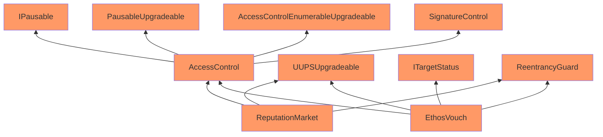

Quick Peach Flamingo

Medium

# Corruptible upgradability pattern

### Summary

The Ethos contracts (`EthosVouch`, `ReputationMarket`) are UUPSUpgradeable. However, the current implementation has multiple issues regarding upgradability.

https://github.com/sherlock-audit/2024-11-ethos-network-ii/blob/main/ethos/packages/contracts/contracts/utils/AccessControl.sol#L15

https://github.com/sherlock-audit/2024-11-ethos-network-ii/blob/main/ethos/packages/contracts/contracts/utils/SignatureControl.sol#L11

### Root Cause

Following is the inheritance chain of the Ethos contracts.

The Ethos contracts are meant to be upgradeable. However, it inherits contracts that are not upgrade-safe.

The AccessControl and SignatureControl are both contracts written by Ethos team, both contain storage slots but there are no gaps implemented.

Also, both `EthosVouch` and `ReputationMarket` inherit the non-upgradeable version ReentrancyGuard from Openzeppelin's library, when it should use the upgradeable version from [openzeppelin-contracts-upgradeable](https://github.com/OpenZeppelin/openzeppelin-contracts-upgradeable) lib.

https://docs.openzeppelin.com/contracts/5.x/upgradeable

### Internal pre-conditions

1. If admin performs an upgrade and wants to add another storage slot in AccessControl or SignatureControl contract, the storage slot would mess up.

### External pre-conditions

_No response_

### Attack Path

_No response_

### Impact

Storage of contracts might be corrupted during upgrading.

### PoC

_No response_

### Mitigation

1. Add gaps in AccessControl, SignatureControl
2. Use library from Openzeppelin-upgradeable instead, e.g. ReentrancyGuardUpgradeable.